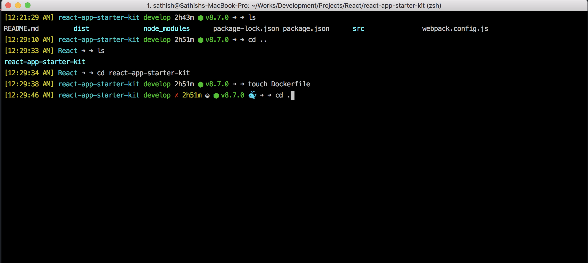

# HYPERZSH - Customized Version

I have started using [ZSH](https://github.com/robbyrussell/oh-my-zsh/) in the recent days and completly fallen in love with it.

Below is my **Terminal** setup.

* [iTerm2](https://www.iterm2.com) (with color presets - dark background)
* [oh-my-zsh](https://github.com/robbyrussell/oh-my-zsh/)
* [hyperzsh](https://github.com/tylerreckart/hyperzsh) theme

## Cusomized hyperzsh Theme

This repository hosts the customized version of [hyperzsh](https://github.com/tylerreckart/hyperzsh) theme with below additions.

* Timestamp
* Node environment
* Docker environment
* more to come..

### Thanks to the creator [@tylerreckart](https://github.com/tylerreckart) for this lovely theme!!